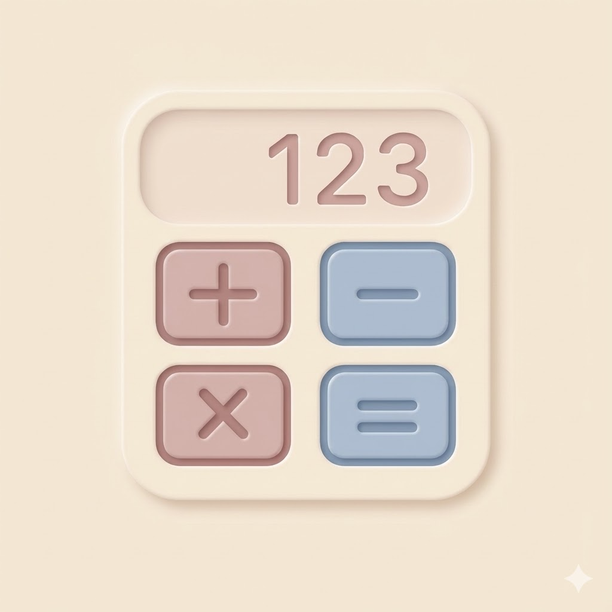

# NeoCalculator

A beautiful, neumorphic-style calculator app built with Flutter. This project demonstrates modern UI design, state management, and cross-platform support for Android, iOS, macOS, Windows, and Web.

---


## ✨ Features

- Neumorphic UI for a soft, modern look
- Basic and advanced calculator functions
- Calculation history
- Customizable themes and preferences (choose from a palette of colors, dynamic color, and fonts)
- Haptic Touch (toggle vibration feedback for button presses)
- Responsive design for mobile, desktop, and web
- Animated buttons and overlays

See [Changelog](appupdate.md) for a version history and [Roadmap](doingnext.md) for planned features.

---

## 📸 Screenshots

<!-- Add your screenshots here -->


---

## 🚀 Getting Started

### Prerequisites
- [Flutter SDK](https://flutter.dev/docs/get-started/install)
- Dart SDK (comes with Flutter)

### Installation

1. **Clone the repository:**
   ```bash
   git clone https://github.com/yourusername/neumo_calculator.git
   cd neumo_calculator
   ```
2. **Install dependencies:**
   ```bash
   flutter pub get
   ```
3. **Run the app:**
   ```bash
   flutter run
   ```
   Or use your preferred IDE (VSCode, Android Studio, etc.)

### Running Tests

To run the unit and widget tests:

```bash
flutter test
```

---

## 📁 Folder Structure

```
lib/
  controllers/        # State management controllers
  repo/               # Data storage and retrieval
  screens/            # UI screens (calculator, dashboard, history, settings)
  utils/              # Utilities, models, and extensions
  widgets/            # Reusable UI components
assets/               # Fonts, icons, lottie animations
```

---

## 🎨 Theme Customization & Extensibility
- Choose from a palette of theme colors or enable dynamic color (system accent color).
- Add new theme colors by updating the `ThemeColor` enum in `lib/utils/enum.dart`.
- Add new fonts by updating the `Fonts` enum in the same file.
- The settings UI and theming system will automatically reflect new options.

---

## 📝 Code Documentation
- All main Dart source files include file-level and section comments.
- Each file clearly states its purpose and the main class or widget it defines.
- This improves code readability, maintainability, and onboarding for new contributors.

---

## 🤝 Contributing

Contributions are welcome! Please open issues or submit pull requests for improvements and bug fixes.

---

## 📄 License

This project is licensed under the MIT License. See [LICENSE](LICENSE) for details.

---

## 🙏 Credits

- [Flutter](https://flutter.dev/)
- [Neumorphic design inspiration](https://dribbble.com/tags/neumorphism)
- [Google Fonts](https://fonts.google.com/)
- [LottieFiles](https://lottiefiles.com/)

---

